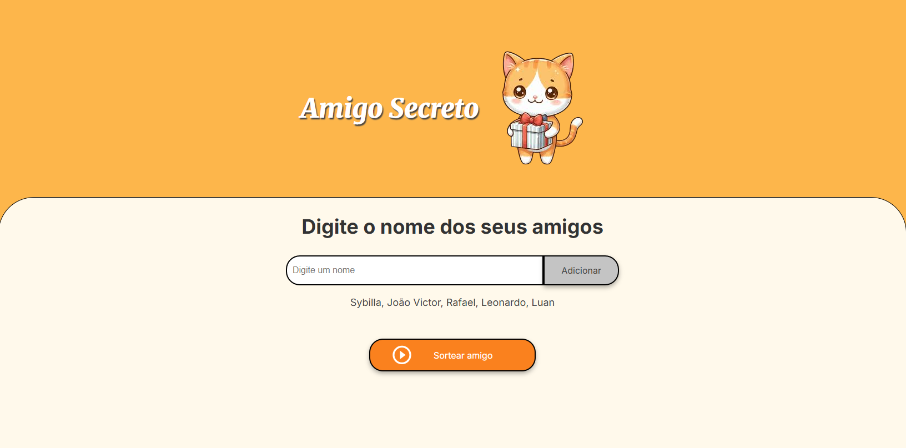
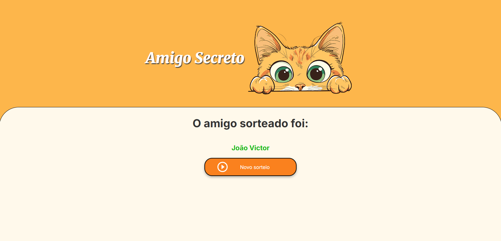

# Amigo Secreto 🎁

## Sobre o Projeto

Este é um aplicativo de "Amigo Secreto" desenvolvido como parte de um desafio proposto pelo programa **Oracle Next Education (ONE)**. O projeto foi feito para praticar e solidificar conhecimentos em **HTML**, **CSS** e, principalmente, **JavaScript**.

A aplicação permite que o usuário adicione nomes a uma lista, e ao final, sorteie um único nome de forma aleatória. É uma ferramenta simples e divertida para organizar sorteios com amigos e familiares.

  

  

## Funcionalidades ✨

- **Adicionar Amigos**: Adicione quantos amigos quiser à lista para o sorteio. O sistema valida se o nome está vazio, contém números ou se já foi adicionado.
- **Sortear um Amigo**: Clique no botão para sortear aleatoriamente um nome da lista.
- **Reiniciar Sorteio**: Após o sorteio, o botão "Sortear Amigo" se transforma em "Novo Sorteio", permitindo que você limpe a lista e comece novamente.
- **Interface Dinâmica**: A interface muda após o sorteio para exibir o resultado de forma clara, ocultando os campos de entrada e a lista de nomes.

## Tecnologias Utilizadas 💻

- **HTML5**: Estrutura da página.
- **CSS3**: Estilização e layout.
- **JavaScript**: Lógica de funcionamento, validações e manipulação da interface (DOM).

## Como Usar

1.  **Adicionar Nomes**: Digite o nome de cada amigo no campo de texto e clique em "Adicionar".
2.  **Verificar a Lista**: Os nomes adicionados aparecerão em uma lista abaixo do campo de entrada.
3.  **Realizar o Sorteio**: Quando a lista tiver pelo menos dois nomes, clique em "Sortear amigo".
4.  **Ver o Resultado**: O nome sorteado será exibido na tela.
5.  **Novo Sorteio**: Para sortear novamente, clique no botão "Novo Sorteio".

## Desafios e Aprendizados

Este projeto foi uma excelente oportunidade para aprofundar o conhecimento em:

- **Manipulação do DOM**: Aprender a interagir dinamicamente com os elementos da página.
- **Lógica de Negócio**: Criar as regras para adicionar amigos e realizar o sorteio de forma correta.
- **Boas Práticas**: Entender a importância de validações e do controle de estado da aplicação (quando o sorteio está ativo ou não).

---

  Desenvolvido com ❤️ por <a href="https://github.com/sybzinha">sybzinha</a>

